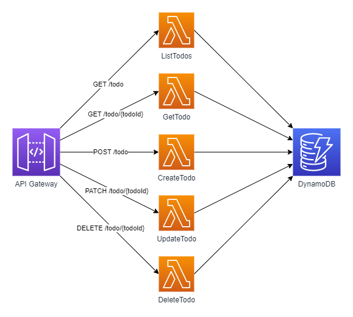

# Workshop 1: Getting Started

## 1. Introduction

In this workshop, you will get your hands dirty and build a simple CRUD API using AWS serverless services.

The API will comprise an API Gateway, five Lambda functions, and a DynamoDB table for storage.

You will also get familiar with an Infrastructure-as-Code tool called AWS CDK. CDK lets you define all the resources that make up your application in a familiar code language.

The solution you will build will look like the following diagram.



### The API

The API will let you create, list, get, update, and delete to-do items. It will have the following five routes:

- **GET /todo** - Lists all to-do items in the application, with support for pagination through `limit` and `next_token` query parameters.

- **GET /todo/{todoId}** - Fetches a single to-do item.

- **POST /todo** - Creates a new to-do item. Requires a `name` parameter in the payload.

- **UPDATE /todo/{todoId}** - Updates a to-do item. Accepts `name` and `completed` parameter in the payload.

- **DELETE /todo/{todoId}** - Deletes a to-do item.

### What is Lambda?

Lambda is the main serverless compute service on AWS. It lets you run code without having to think about servers. AWS takes care of stuff like high availability, scalability, and OS & runtime patching. This lets you focus on what matters, the business logic of your application.

The Lambda service invokes your function in response to different events. These can both be synchronous and asynchronous. Lambda spins up isolated environments to handle any load thrown at it and scales back down when idle. This means that you only incur costs while your code is running.

The entry point of a Lambda function is the `handler` method, which is run by the Lambda service when a function is invoked. It accepts two arguments, `event` and `context`, that include information about the invoker and the execution context. The contents and structure of the `event` argument vary depending on the triggering service.

For example, when invoking a Lambda function from an API Gateway, the `event` looks like this:

```json
{
      "resource": "/",
      "path": "/",
      "httpMethod": "GET",
      "requestContext": {
          "resourcePath": "/",
          "httpMethod": "GET",
          "path": "/Prod/",
          ...
      },
      "headers": {
          "accept": "text/html,application/xhtml+xml,application/xml;q=0.9,image/webp,image/apng,*/*;q=0.8,application/signed-exchange;v=b3;q=0.9",
          "accept-encoding": "gzip, deflate, br",
          "Host": "70ixmpl4fl.execute-api.us-east-2.amazonaws.com",
          "User-Agent": "Mozilla/5.0 (Windows NT 10.0; Win64; x64) AppleWebKit/537.36 (KHTML, like Gecko) Chrome/80.0.3987.132 Safari/537.36",
          "X-Amzn-Trace-Id": "Root=1-5e66d96f-7491f09xmpl79d18acf3d050",
          ...
      },
      "multiValueHeaders": {
          "accept": [
              "text/html,application/xhtml+xml,application/xml;q=0.9,image/webp,image/apng,*/*;q=0.8,application/signed-exchange;v=b3;q=0.9"
          ],
          "accept-encoding": [
              "gzip, deflate, br"
          ],
          ...
      },
      "queryStringParameters": null,
      "multiValueQueryStringParameters": null,
      "pathParameters": null,
      "stageVariables": null,
      "body": null,
      "isBase64Encoded": false
  }
```

### What is API Gateway?

API Gateway is a fully managed service that makes it easy to manage APIs at any scale. There are two versions of API Gateway. AWS calls these different versions REST APIs and HTTP APIs and they have different capabilities.

REST APIs support more features than HTTP APIs. REST APIs gives you, among other things, API keys, per-client usage quotas, and request/response transformation. HTTP APIs are simpler and cheaper. You can find a comparison of the two [in the AWS docs](https://docs.aws.amazon.com/apigateway/latest/developerguide/http-api-vs-rest.html).

I prefer the simpler setup of HTTP APIs myself. But, due to the fact that only REST APIs allow you to attach a Web Application Firewall, I tend to use REST APIs. It's on the roadmap to add support for WAF in HTTP APIs. Until then, I'd recommend using REST APIs for production applications.

### What is DynamoDB?

DynamoDB is a fully managed NoSQL database that handles any scale. The operational overhead that usually comes with databases does not exist with DynamoDB. High availability, reliability, replication, scaling, and more are all handled out-of-the-box by AWS.

DynamoDB stores data in tables. Tables contain items, which correspond to rows or records in a relational database. Each item has a primary key and a set of attributes. Being NoSQL, there is no imposed schema on the items, and different items might have a different set of attributes.

In this workshop, we will use a DynamoDB table to store to-do items with the following "schema":

| todoId | name           | completed | createdAt     | updatedAt     |
| ------ | -------------- | --------- | ------------- | ------------- |
| 1      | Write workshop | true      | 1662446054585 | 1662446054585 |
| 2      | Test workshop  | true      | 1662446054585 | 1662446054585 |
| 3      | Host workshop  | false     | 1662446054585 | 1662446054585 |

### What is CloudFormation?

CloudFormation is AWS's answer to Infrastructure-as-Code. It lets you model, provision, and manage your resources on AWS.

You can group all required resources for an application in a stack. This stack is then deployed as a whole, making it easy to manage the lifecycle of your application. Whenever you need to update something, you upload an updated template. CloudFormation compares the new template with the current one and makes the necessary changes. If something goes awry, you can roll back to the previous template.

Using an Infrastructure-as-Code tool is crucial to make releases in a safe and reproducible manner. It also makes it easier to make sure your dev, staging, and production environments are as similar as possible.

You write CloudFormation templates in either JSON or YAML, and a **MINIMAL** example can look like this:

```yaml
Resources:
  LambdaFunction:
    Type: "AWS::Lambda::Function"
    Properties:
      FunctionName: AwsLambdaMinimalExample
      Handler: index.handler
      Runtime: nodejs14.x
      Role: !GetAtt LambdaFunctionRole.Arn
      MemorySize: 1024
      Code:
        ZipFile: |
          exports.handler = async (event) => {
            return "Hello World!";
          }
  LambdaFunctionRole:
    Type: AWS::IAM::Role
    Properties:
      AssumeRolePolicyDocument:
        Version: "2012-10-17"
        Statement:
          - Effect: Allow
            Principal:
              Service:
                - lambda.amazonaws.com
            Action:
              - sts:AssumeRole
      Path: "/"
      Policies:
        - PolicyName: AppendToLogsPolicy
          PolicyDocument:
            Version: "2012-10-17"
            Statement:
              - Effect: Allow
                Action:
                  - logs:CreateLogGroup
                  - logs:CreateLogStream
                  - logs:PutLogEvents
                Resource: "*"
```

Quite verbose isn't it? While CloudFormation does support parameters and intrinsic functions to help, there is a better way. This leads us to...

### What is CDK?

AWS CDK (**C**loud **D**evelopment **K**it) lets you use familiar programming languages to model your applications. In CDK, you work with high-level components called constructs to define your resources. These come with sensible defaults and abstract away a lot of the complex stuff.

Under the hood, CDK uses CloudFormation to provision and manage your resources.

## 2. Initializing a new project

Time to get your hands dirty! Start by creating an empty CDK application in an empty directory:

```bash
$ mkdir todo-app && cd todo-app
$ cdk init app --language=typescript --generate-only
$ yarn
```

This should have created the following directory structure:

```
.
├── README.md
├── bin
│   └── todo-app.ts
├── cdk.json
├── jest.config.js
├── lib
│   └── todo-app-stack.ts
├── package.json
├── test
│   └── todo-app.test.ts
└── tsconfig.json
```

Let's take a tour:

**cdk.json** is the main configuration file for your CDK application. Among other things, it tells CDK where to find the entry point for your application. In this case, this is `"app": "npx ts-node --prefer-ts-exts bin/todo-app.ts"`.

**bin/todo-app.ts** is the entry point of your CDK _application_. This is where you define all your stacks, their parameters, and in which environment you want to deploy them. You can see stacks as a container of resources that you deploy together. An application can comprise many stacks and you can _share_ resources between stacks. In the generated **todo-app.ts** file, you will find the following import:

```typescript
import { TodoAppStack } from "../lib/todo-app-stack";
```

This brings us to **lib/todo-app-stack.ts**. In this file, we will define all resources that make up the `TodoAppStack`. Remove the comments in this file so that it looks like this:

```typescript
import * as cdk from "aws-cdk-lib";
import { Construct } from "constructs";

export class TodoAppStack extends cdk.Stack {
  constructor(scope: Construct, id: string, props?: cdk.StackProps) {
    super(scope, id, props);
  }
}
```

Having all of our infrastructure as code gives another benefit. It makes it possible to unit test our infrastructure. The generator includes a sample test file **test/todo-app.test.ts**.

## 3. Adding your first lambda function

As I mentioned earlier, CDK includes high-level components called constructs. There are constructs of varying _levels_ which abstracts away increasingly more configuration. For our Lambda functions, we will use a construct called [NodeJSFunction](https://docs.aws.amazon.com/cdk/api/v2/docs/aws-cdk-lib.aws_lambda_nodejs.NodejsFunction.html). This construct comes with built-in bundling logic to bundle our function and its dependencies with `esbuild`. CDK will then take care of the packaging and uploading of our function code.

1. Install `esbuild` to enable the construct to bundle with it:

   ```bash
   $ yarn add --dev esbuild
   ```

1. You also need to install types for AWS Lambda. This will help when developing since you will get types for all the possible variations of the `event` argument.

   ```bash
   $ yarn add --dev @types/aws-lambda
   ```

1. Create a new file `functions/get_todo/handler.ts` and add the following:

   ```typescript
   import { APIGatewayProxyEvent, APIGatewayProxyResult } from "aws-lambda";

   export const handler = async function (
     event: APIGatewayProxyEvent
   ): Promise<APIGatewayProxyResult> {
     console.log(event);
     return {
       statusCode: 200,
       body: `Hello from ${event.httpMethod} ${event.path}`,
     };
   };
   ```

   This function logs the incoming request, and returns a `200 OK` with a message.

1. Now you will add your function to your CDK application. In `lib/todo-app-stack.ts`, add the following:

   ```typescript
   /* ... */
   import { NodejsFunction } from "aws-cdk-lib/aws-lambda-nodejs";
   import { Runtime } from "aws-cdk-lib/aws-lambda";

   export class TodoAppStack extends cdk.Stack {
     constructor(scope: Construct, id: string, props?: cdk.StackProps) {
       super(scope, id, props);

       // Lambda Functions
       const getFunction = new NodejsFunction(this, "GetTodoFunction", {
         entry: "functions/get_todo/handler.ts",
         handler: "handler",
         runtime: Runtime.NODEJS_16_X,
         memorySize: 1024,
         timeout: cdk.Duration.seconds(29),
       });
     }
   }
   ```

   Here, you specify the location of the file in `entry` and the name of the handler function in that file in `handler`. You also specify how much memory your function is allowed to use and what version of NodeJs you want your function to run in. NodeJs 18.x is not available as a runtime yet...

1. We also need a way to call our Lambda function, so lets create an API Gateway to front it. Continue in `lib/todo-app-stack.ts`.

   ```typescript
   /* ... */
   import { RestApi, LambdaIntegration } from "aws-cdk-lib/aws-apigateway";

   export class TodoAppStack extends cdk.Stack {
     constructor(scope: Construct, id: string, props?: cdk.StackProps) {
       super(scope, id, props);

       // Lambda Functions
       const getFunction = new NodejsFunction(/* ... */);

       // REST API
       const restApi = new RestApi(this, "RestApi", {});
       const todos = restApi.root.addResource("todo");
       const todo = todos.addResource("{todoId}");
       todo.addMethod("GET", new LambdaIntegration(getFunction));
     }
   }
   ```

   Here, you first create a new REST API. You then add a resource `/todo` to the root of the API, followed by a sub-resource `/{todoId}`. You then specify that for `GET` requests to `/todo/{todoId}`, you want to invoke the Lambda function you created earlier.

1. Let's try it out. In the root (`todo-app`) directory, you can deploy your application with the following command:

   ```bash
   $ cdk deploy
   ```

   It will ask for you to confirm the deployment since it requires changes to the IAM service (more on that later). After confirmation, wait a bit until the stack is deployed. In the console output, you should see the following at the end:

   ```bash
   ...

   Outputs:
   TodoAppStack.RestApiEndpoint12345678 = https://abcdefghi.execute-api.eu-west-1.amazonaws.com/prod/
   ```

1. Call your newly deployed API any way you'd like. If you haven't yet seen the amazing CLI called [httpie](https://httpie.io/) before, you're welcome.

   ```bash
   $ http https://abcdefghi.execute-api.eu-west-1.amazonaws.com/prod/todo/12345
   HTTP/1.1 200 OK
   Connection: keep-alive
   Content-Length: 26
   Content-Type: application/json
   Date: Tue, 06 Sep 2022 16:41:47 GMT
   Via: 1.1 ff7194a111d1912088727cbee9f13db0.cloudfront.net (CloudFront)
   X-Amz-Cf-Id: xlLVvwAHbg94c_JDo_KYvZp2wvGm8TrIThzGGCiu5lXqaprCutN6XA==
   X-Amz-Cf-Pop: ARN56-P1
   X-Amzn-Trace-Id: Root=1-6317784b-7b93f9515ba11d2c382b5c4a;Sampled=0
   X-Cache: Miss from cloudfront
   x-amz-apigw-id: YC-73GnaDoEF7Eg=
   x-amzn-RequestId: 5666c97c-942b-4383-b4b2-dfbc6518c271

   Hello from GET /todo/12345
   ```

1. Well done! You have now deployed your serverless API on AWS. Take a step back and recap what you have done. Feel free to login to the AWS Management Console and take a look at the **CloudFormation** console. There you should see your stack named `TodoAppStack`. You can also explore the Lambda console and API Gateway console to see what CDK has created for you.

1. Speaking of CDK. Remember how I mentioned before that raw CloudFormation was overly verbose? Execute `cdk synth` in your terminal, and you will see the raw CloudFormation YAML that CDK has synthesized in the background.

## 4. Add the remaining functions

Now that you have a starting point, go ahead and add the remaining four functions. You want to add functions for the following endpoints:

- **GET /todo** - `functions/list_todos/handler.ts`
- **POST /todo** - `functions/create_todo/handler.ts`
- **PATCH /todo/{todoId}** - `functions/update_todo/handler.ts`
- **DELETE /todo/{todoId}** - `functions/delete_todo/handler.ts`

For now, you can re-use the same code as in `functions/get_todo/handler.ts`. Add the new functions and the integration with the API Gateway in `lib/todo-app-stack.ts`.

If you look at the configuration of all your functions, you will notice that many parameters are the same. Take advantage of code and extract the common parameters to an object:

```typescript
import {
  NodejsFunction,
  NodejsFunctionProps,
} from 'aws-cdk-lib/aws-lambda-nodejs';

/* ... */

export class TodoAppStack extends cdk.Stack {
  constructor(scope: Construct, id: string, props?: cdk.StackProps) {
    super(scope, id, props);

    /* ... */

    const commonFunctionProps: NodejsFunctionProps = {
      handler: 'handler',
      runtime: Runtime.NODEJS_16_X,
      memorySize: 1024,
      timeout: cdk.Duration.seconds(29)
    }

    // Lambda Functions
    const getFunction = new NodejsFunction(this, 'GetTodoFunction', {
      entry: 'functions/get_todo/handler.ts',
      ...commonFunctionProps,
    });

    /* ... */
  };

```

Deploy the new functions with `cdk deploy` and test the different routes.

## 5. Add a DynamoDB table

Let's add a DynamoDB table to our application. As mentioned in the introduction, we will use a partition key called `todoId`. More advanced use cases of DynamoDB table requires the usage of composite keys, in which you combine a `partition key` and `sort key` to make up the primary key. More on that in a future workshop.

The table should be added in, you guessed correctly, `lib/todo-app-stack.ts`:

```typescript
/* ... */
import { Table, AttributeType, BillingMode } from "aws-cdk-lib/aws-dynamodb";

export class TodoAppStack extends cdk.Stack {
  constructor(scope: Construct, id: string, props?: cdk.StackProps) {
    super(scope, id, props);

    // DynamoDB Table
    const table = new Table(this, "TodoTable", {
      partitionKey: {
        name: "todoId",
        type: AttributeType.STRING,
      },
      billingMode: BillingMode.PAY_PER_REQUEST,
      pointInTimeRecovery: true,
    });

    // Lambda Functions
    /* ... */
  }
}
```

Here you specify that your table should have a partition key named `todoId` and that the type should be `STRING`. You also set the billing mode to `PAY_PER_REQUEST`. This means that your table will only incur costs when your are using it, i.e. performing reads and writes.

The other available billing mode is `PROVISIONED`. Then you specify the number of read and write capacity units you want your table to have. You will then be charged based on how much you have provisioned. This can save costs when you have a predictable load on your table.

You also enable `pointInTimeRecovery`, which is a built-in backup mechanism in DynamoDB. It lets you recover your database to a specific point in time. Enabling backups is in almost all cases a best practice, so might as well start doing it from the start.

## 6. CreateTodo Lambda

Alright, you now have an empty table lying around. Let's write some code to actually use it. You will start by implementing the logic for creating a to-do item.

To communicate with DynamoDB from your function, you will use [AWS SDK for JavaScript v3](https://docs.aws.amazon.com/AWSJavaScriptSDK/v3/latest/index.html). Add the needed DynamoDB clients as dependencies.

```bash
$ yarn add @aws-sdk/lib-dynamodb @aws-sdk/client-dynamodb
```

The SDK comes with both `DynamoDBClient` and `DynamoDBDocumentClient`. The latter one is more high-level and makes it easier to work with DynamoDB in TypeScript. DynamoDB uses a json-like format internally, which is cumbersome to work with:

```typescript
const item = {
  todoId: {
    S: "xyz",
  },
  name: {
    S: "name",
  },
  completed: {
    BOOL: true,
  },
  createdAt: {
    N: 1662446054585,
  },
  updatedAt: {
    N: 1662446054585,
  },
};
```

`DynamoDBDocumentClient` allows you to work directly with JavaScript objects instead:

```typescript
const item = {
  todoId: "xyz",
  name: "name",
  completed: true,
  createdAt: 1662446054585,
  deletedAt: 1662446054585,
};
```

You will need a third dependency, `uuid`, to generate random IDs for your to-do items.

```bash
$ yarn add uuid
```

Let's recap how the `POST /todo` endpoint should behave. It should accept, or rather require, a `name` parameter in the JSON payload of the request. You should then automatically generate a unique `todoId` and set the initial completed status to be `false`. It could also be useful to know when a to-do was created and last updated, so you are going to add the `createdAt` and `updatedAt` attributes as well.

Your function also needs to know the name of the DynamoDB table to work against. This will be added as an environment variable. Add it to the common function properties in `lib/todo-app-stack.ts`:

```typescript
const table = new Table(/* ... */);

const commonFunctionProps: NodejsFunctionProps = {
  /* ... */
  environment: {
    TABLE_NAME: table.tableName,
  },
};
```

Now, let's implement some actual business logic in `functions/create_todo/handler.ts`.

1. Start by instantiating a DynamoDB client OUTSIDE of the handler function. By doing it outside the function, you take advantage of execution environment re-use.

   When a Lambda function gets invoked, an execution environment is initialized. These execution environments a re re-used for subsequent invocations. When no environment exist, or all current environments are busy handling invocations, you will have what is known as a _cold start_. By instantiating stuff like SDK clients outside the handler, you can save on execution time in _warm starts_.

   ```typescript
   import { DynamoDBClient } from "@aws-sdk/client-dynamodb";
   import { DynamoDBDocumentClient, PutCommand } from "@aws-sdk/lib-dynamodb";
   import { v4 as uuidv4 } from "uuid";

   const TABLE_NAME = process.env.TABLE_NAME || '';
   const client = DynamoDBDocumentClient.from(new DynamoDBClient({}));

   export const handler = async function ( /* ... */ )
   ```

1. Now, let's do some crude validation on the `event` payload. There are better ways to do this with middlewares, which we might explore later, but for now, we will keep it simple. We need to validate that there is a payload, parse it, and check that the required `name` attribute is present. In the handler function, add the following:

   ```typescript
   if (!event.body) {
     return {
       statusCode: 400,
       body: "Missing body in request",
     };
   }

   const data = JSON.parse(event.body);

   if (typeof data.name !== "string" || data.name.length < 1) {
     return {
       statusCode: 400,
       body: "Missing name property in payload",
     };
   }
   ```

1. If the `name` attribute is present, continue and write the new to-do item to DynamoDB using `PutCommand`. Use `uuid` to create a random unique ID, set `completed` to `false`, and set `createdAt` and `updatedAt` to the current timestamp.

   ```typescript
   const timestamp = new Date().getTime();

   const item = {
     todoId: uuidv4(),
     name: data.name,
     completed: false,
     createdAt: timestamp,
     updatedAt: timestamp,
   };

   await client.send(
     new PutCommand({
       TableName: TABLE_NAME,
       Item: item,
     })
   );
   ```

1. Finally, return the created to-do item together with a `201 CREATED` status code.

   ```typescript
   return {
     statusCode: 201,
     body: JSON.stringify(item),
   };
   ```

Deploy your application with `cdk deploy` and try it out. Everything will surely work, or will it?

```bash
$ http post https://abcdefghij.execute-api.eu-west-1.amazonaws.com/prod/todo name="name"
HTTP/1.1 502 Bad Gateway
Connection: keep-alive
Content-Length: 36
Content-Type: application/json
Date: Tue, 06 Sep 2022 20:14:04 GMT
Via: 1.1 9803a30a87f1ec1047cb2b8ad5ecc43e.cloudfront.net (CloudFront)
X-Amz-Cf-Id: C5xSly4TA1BvudKUfYLIcb9VZ-jw1kiVqHzKtvgyrLbxsk07byt4wg==
X-Amz-Cf-Pop: ARN56-P1
X-Cache: Error from cloudfront
x-amz-apigw-id: YDeB5Gb6DoEFp5A=
x-amzn-ErrorType: InternalServerErrorException
x-amzn-RequestId: 6400a316-c186-44e3-b604-d1bc60b62f1e

{
    "message": "Internal server error"
}
```

## 7. What went wrong?

Head over to the AWS Management Console and go to the CloudWatch console. Click on _Logs Insights_ in the left pane. In the _Select log group(s)_ dropdown, select the CreateTodo Lambda function. Note that Lambda function will have an autogenerated name that will look similar to `TodoAppStack-CreateTodoFunction1234ABCD-asdfjasdklf`. CDK automatically names your resources to avoid naming conflicts in your accounts.

After selecting the log group, click the _Run query_ button. In the bottom pane, you should now see all logs generated from your Lambda function. If you cannot see any logs, try waiting a bit. There is a slight delay before logs are available in CloudWatch.

You should find a log entry for the `Internal Server Error` that occurred in your function:

```json
"errorType": "AccessDeniedException",
"errorMessage": "User: arn:aws:sts::1234567890:assumed-role/TodoAppStack-CreateTodoFunctionServiceRoleXYZ-123/TodoAppStack-CreateTodoFunctionXYZ-123 is not authorized to perform: dynamodb:PutItem on resource: arn:aws:dynamodb:eu-west-1:1234567890:table/TodoAppStack-TodoTableXYZ-123 because no identity-based policy allows the dynamodb:PutItem action"
```

This error message says that the function execution role does not have sufficient permissions to perform `dynamodb:PutItem` on the table. In AWS, all access is managed by the IAM service and each Lambda function has an attached IAM role. The IAM policies on this role defines what a function is allowed to do. In your case, you haven't made any explicit changes to the roles so you only have what CDK created by default (permissions to log to CloudWatch for example).

Let's give the functions access to your DynamoDB table. Most CDK constructs have helper functions that simplifies this. In `lib/todo-app-stack.ts`, add the following:

```typescript
const table = new Table(/* ... */);
const getFunction = new NodeJSFunction(/* ... */);
const listFunction = new NodeJSFunction(/* ... */);
const createFunction = new NodeJSFunction(/* ... */);
const updateFunction = new NodeJSFunction(/* ... */);
const deleteFunction = new NodeJSFunction(/* ... */);

// Add Lambda runtime permissions
table.grantReadData(getFunction);
table.grantReadData(listFunction);
table.grantWriteData(createFunction);
table.grantWriteData(updateFunction);
table.grantWriteData(deleteFunction);
```

This will give the `getFunction` and `listFunction` permissions to read data from your table. The other functions will be allowed to write data. Giving granular access like this is a best practice in AWS. It follows what is called the [principle of least privilege](https://docs.aws.amazon.com/IAM/latest/UserGuide/best-practices.html#grant-least-privilege).

Deploy your stack and try out the create endpoint again. Note that it can take a few moments for the IAM service to propagate changes.

```bash
$ http post https://abcdefghij.execute-api.eu-west-1.amazonaws.com/prod/todo name="name"
HTTP/1.1 201 Created
Connection: keep-alive
Content-Length: 133
Content-Type: application/json
Date: Wed, 07 Sep 2022 05:58:55 GMT
Via: 1.1 d71a7f4027481327b033ea7bb8ffab7a.cloudfront.net (CloudFront)
X-Amz-Cf-Id: GWkHI3-dMKK7SonxAPz2iFwZrXtNfJO9r25OSLHXiBHGXF-GwHtZoA==
X-Amz-Cf-Pop: ARN56-P1
X-Amzn-Trace-Id: Root=1-6318331e-379e9e2f2866421c38320147;Sampled=0
X-Cache: Miss from cloudfront
x-amz-apigw-id: YEzswFGjjoEFVqg=
x-amzn-RequestId: f6dd9c8d-a46d-4670-bb94-a41991513347

{
    "completed": false,
    "createdAt": 1662530334845,
    "name": "name",
    "todoId": "8371eae9-f7fb-4b7a-9d61-1dd5a9e92a42",
    "updatedAt": 1662530334845
}
```

Nice! Verify that the validation works as expected as well by calling the endpoint without supplying `name` in the payload.

```bash
$ http post https://abcdefghij.execute-api.eu-west-1.amazonaws.com/prod/todo field="value"
HTTP/1.1 400 Bad Request
Connection: keep-alive
Content-Length: 32
Content-Type: application/json
Date: Wed, 07 Sep 2022 06:17:20 GMT
Via: 1.1 d7969a7dfe0a063d186d3c72531d67be.cloudfront.net (CloudFront)
X-Amz-Cf-Id: bYOQYyPDWytYA2DBgj2q8eMyRtXSrWojwq4GHX3t8VNK6TOU3wyOVw==
X-Amz-Cf-Pop: ARN56-P1
X-Amzn-Trace-Id: Root=1-63183770-7a2c804e0ac7ca0b1ab09db2;Sampled=0
X-Cache: Error from cloudfront
x-amz-apigw-id: YE2ZkGn0DoEFjoQ=
x-amzn-RequestId: 72655f4d-ae27-483d-b1b9-5481d321ff07

Missing name property in payload
```

## 8. Speeding up the development cycle

Up until now you have deployed the entire CDK application to your AWS account whenever you have made a change. Now, you will see how you can use the **AWS SAM CLI** to run your API locally. SAM is another tool that makes it easier to build, deploy, and manage serverless applications on AWS. [This blog post](https://aws.amazon.com/blogs/compute/better-together-aws-sam-and-aws-cdk/) has an in-depth description about how CDK and SAM works together.

When running locally, SAM emulates your API Gateway and Lambda functions. Other resources, such as your DynamoDB table will not be running locally. Any writes you perform in your Lambda function will be reflected in your deployed table.

Since you define the table name as an environment variable, you need to create a local environment file for SAM to use. Create a file named `.env.local.json` and add the following:

```json
{
  "Parameters": {
    "TABLE_NAME": "YOUR_TABLE_NAME"
  }
}
```

You can find your table name in the AWS Management Console. Find your stack in the CloudFormation console, click on the _Resources_ tab and look for a resource with a _Logical ID_ starting with `TodoTable`. You want the _Physical ID_ of this resource.

Now, in another terminal (make sure you have active AWS credentials):

```bash
$ cdk synth
...
$ sam local start-api -t cdk.out/TodoAppStack.template.json --env-vars .env.local.json

Mounting ListTodoFunction0D379A45 at http://127.0.0.1:3000/todo [GET]
Mounting CreateTodoFunction483A09B6 at http://127.0.0.1:3000/todo [POST]
Mounting GetTodoFunction77C0DE28 at http://127.0.0.1:3000/todo/{todoId} [GET]
Mounting UpdateTodoFunction6CD7583A at http://127.0.0.1:3000/todo/{todoId} [PATCH]
Mounting DeleteTodoFunction199B584C at http://127.0.0.1:3000/todo/{todoId} [DELETE]

...
```

`cdk synth` will synthesize your CDK application into CloudFormation templates. SAM is then able to use this CloudFormation template to use it's local functionality. You can now call your API locally on port `3000`. Whenever you make a change in a Lambda function, you have to `cdk synth` again before running `sam local start-api`.

Try creating a to-do item through your local API:

```bash
$ http post http://localhost:3000/todo name=keso
HTTP/1.0 201 CREATED
Content-Length: 132
Content-Type: application/json
Date: Wed, 07 Sep 2022 07:02:18 GMT
Server: Werkzeug/1.0.1 Python/3.9.7

{
    "completed": false,
    "createdAt": 1662534137392,
    "name": "keso",
    "todoId": "ef2fd1cd-9f64-4097-8cee-2f55dcc99ae2",
    "updatedAt": 1662534137392
}
```

## 9. GetTodo Lambda

Continue with the GetTodo function. This function should fetch a to-do item with a specific `todoId` from the table. If no item is returned, it means that it does not exist, and in that case you want to return a `404 NOT FOUND`.

Implement get functionality in `functions/get_todo/handler.ts` using the DynamoDB Client's `GetCommand`.

<details>
<summary>GetTodo code spoiler</summary>

```typescript
import { APIGatewayProxyEvent, APIGatewayProxyResult } from "aws-lambda";
import { DynamoDBClient } from "@aws-sdk/client-dynamodb";
import { DynamoDBDocumentClient, GetCommand } from "@aws-sdk/lib-dynamodb";

const TABLE_NAME = process.env.TABLE_NAME || "";
const client = DynamoDBDocumentClient.from(new DynamoDBClient({}));

export const handler = async function (
  event: APIGatewayProxyEvent
): Promise<APIGatewayProxyResult> {
  const todoId = event.pathParameters?.todoId;

  const item = await client.send(
    new GetCommand({
      TableName: TABLE_NAME,
      Key: {
        todoId,
      },
    })
  );

  if (!item.Item) {
    return {
      statusCode: 404,
      body: JSON.stringify({
        error: `Todo with ID ${todoId} not found`,
      }),
    };
  }

  const response = {
    todoId: item.Item.todoId,
    name: item.Item.name,
    completed: item.Item.completed,
    createdAt: item.Item.createdAt,
    updatedAt: item.Item.updatedAt,
  };

  return {
    statusCode: 200,
    body: JSON.stringify(response),
  };
};
```

</details>

Re-build and start the API locally:

```bash
$ cdk synth && sam local start-api -t cdk.out/TodoAppStack.template.json --env-vars .env.local.json
```

First, create a new to-do item and take note of the generated `todoId`. Then fetch that todo with the `GET /todo/{todoId}` endpoint:

```bash
$ http post http://localhost:3000/todo name=keso
HTTP/1.0 201 CREATED
Content-Length: 132
Content-Type: application/json
Date: Wed, 07 Sep 2022 09:39:39 GMT
Server: Werkzeug/1.0.1 Python/3.9.7

{
    "completed": false,
    "createdAt": 1662543577655,
    "name": "keso",
    "todoId": "3eccce10-026d-45dc-ad4f-7bf309ac6eb3",
    "updatedAt": 1662543577655
}

$ http http://localhost:3000/todo/3eccce10-026d-45dc-ad4f-7bf309ac6eb3
HTTP/1.0 200 OK
Content-Length: 132
Content-Type: application/json
Date: Wed, 07 Sep 2022 09:40:00 GMT
Server: Werkzeug/1.0.1 Python/3.9.7

{
    "completed": false,
    "createdAt": 1662543577655,
    "name": "keso",
    "todoId": "3eccce10-026d-45dc-ad4f-7bf309ac6eb3",
    "updatedAt": 1662543577655
}
```

## 10. DeleteTodo Lambda

The `DELETE /todo/{todoId}` route should delete the specified to-do item if it exists. If it does not exist, you want to return a `404 NOT FOUND` status. The DynamoDB `DeleteItem` operation is idempotent, meaning that if you run it multiple times on the same item it will not result in an error response. So, to be able to catch the case when an item does not exist, you will use a `ConditionExpression` in the operation. [The docs](https://docs.aws.amazon.com/amazondynamodb/latest/developerguide/Expressions.ConditionExpressions.html) has more information about condition expressions.

In this case, you want to validate that the item exist in the expression. You can do this with the `attribute_exists(PRIMARY_KEY)` function. If the expression evaluates to false, the SDK call will throw a `ConditionalCheckFailedException`.

Implement delete functionality in `functions/delete_todo/handler.ts` using the DynamoDB Client's `DeleteCommand`.

<details>
<summary>DeleteTodo code spoiler</summary>

```typescript
import { APIGatewayProxyEvent, APIGatewayProxyResult } from "aws-lambda";
import {
  DynamoDBClient,
  ConditionalCheckFailedException,
} from "@aws-sdk/client-dynamodb";
import { DeleteCommand, DynamoDBDocumentClient } from "@aws-sdk/lib-dynamodb";

const TABLE_NAME = process.env.TABLE_NAME || "";
const client = DynamoDBDocumentClient.from(new DynamoDBClient({}));

export const handler = async function (
  event: APIGatewayProxyEvent
): Promise<APIGatewayProxyResult> {
  console.log(event);

  const todoId = event.pathParameters?.todoId;

  try {
    await client.send(
      new DeleteCommand({
        TableName: TABLE_NAME,
        Key: {
          todoId,
        },
        ConditionExpression: "attribute_exists(todoId)",
      })
    );
  } catch (err: any) {
    if (err instanceof ConditionalCheckFailedException) {
      return {
        statusCode: 404,
        body: JSON.stringify({
          error: `Todo with ID ${todoId} not found`,
        }),
      };
    } else {
      throw err;
    }
  }

  return {
    statusCode: 204,
    body: "",
  };
};
```

</details>

Try it out locally or by deploying the CDK application:

```bash
$ http post http://localhost:3000/todo name=keso
HTTP/1.0 201 CREATED
Content-Length: 132
Content-Type: application/json
Date: Wed, 07 Sep 2022 14:04:13 GMT
Server: Werkzeug/1.0.1 Python/3.9.7

{
    "completed": false,
    "createdAt": 1662559451751,
    "name": "keso",
    "todoId": "7d20e102-1c02-474e-b270-853914852356",
    "updatedAt": 1662559451751
}

$ http http://localhost:3000/todo/7d20e102-1c02-474e-b270-853914852356
HTTP/1.0 200 OK
Content-Length: 132
Content-Type: application/json
Date: Wed, 07 Sep 2022 14:04:24 GMT
Server: Werkzeug/1.0.1 Python/3.9.7

{
    "completed": false,
    "createdAt": 1662559451751,
    "name": "keso",
    "todoId": "7d20e102-1c02-474e-b270-853914852356",
    "updatedAt": 1662559451751
}

$ http delete http://localhost:3000/todo/7d20e102-1c02-474e-b270-853914852356
HTTP/1.0 204 NO CONTENT
Content-Type: application/json
Date: Wed, 07 Sep 2022 14:04:29 GMT
Server: Werkzeug/1.0.1 Python/3.9.7

$ http http://localhost:3000/todo/7d20e102-1c02-474e-b270-853914852356
HTTP/1.0 404 NOT FOUND
Content-Length: 71
Content-Type: application/json
Date: Wed, 07 Sep 2022 14:04:33 GMT
Server: Werkzeug/1.0.1 Python/3.9.7

{
    "error": "Todo with ID 7d20e102-1c02-474e-b270-853914852356 not found"
}
```

## 11. UpdateTodo Lambda

A user can now create, get, and delete to-do items. But what good is that if they cannot update them to flag them as completed? The `PATCH /todo/{todoId}` endpoint should accept a payload with one of (or both) `name` and `completed` attributes. A `400 BAD REQUEST` should be returned if the payload contains neither. If a to-do with the specified id does not exist, return a `404 NOT FOUND`. When an item is updated, the `updatedAt` field should be updated as well to the current timestamp.

The `UpdateItem` operation in DynamoDB is a bit more complicated than the others you have seen so far. When updating an item, you need to specify an `UpdateExpression` as well as a mapping for the attribute name and values inside that expression. The operation parameters could look like this:

```typescript
const params = {
  TableName: "MYTABLE",
  Key: {
    id: "1",
  },
  UpdateExpression: "set attribute1 = :a1, #A2 = :a2",
  ExpressionAttributeNames: {
    "#A2": "attribute2",
  },
  ExpressionAttributeValues: {
    ":a1": "value1",
    ":a2": "value2",
  },
};

await client.send(new UpdateCommand(params));
```

These parameters describe an update on the item with `id=1`. It updates the attributes `attribute1` and `attribute2` to `value1` and `value2` respectively. You can also see the mappings for `:a1` and `:a2` in the `UpdateExpression` in the `ExpressionAttributeValues` parameter.

`ExpressionAttributeNames` is only required in special cases, such as when your attribute name matches one of the **reserved** names in DynamoDB. The `name` attribute in your table is a reserved keyword, so you are not able to use an `UpdateExpression` that looks like `set name = :name`.

The user should be able to update `name` and `completed` both individually and together. Thus, you need to dynamically build the `UpdateExpression`, `ExpressionAttributeNames`, and `ExpressionAttributeValues` parameters depending on the incoming payload.

Implement update functionality in `functions/update_todo/handler.ts` using the DynamoDB Client's `UpdateCommand`.

<details>
<summary>UpdateTodo code spoiler</summary>

```typescript
import { APIGatewayProxyEvent, APIGatewayProxyResult } from "aws-lambda";
import {
  DynamoDBClient,
  ConditionalCheckFailedException,
} from "@aws-sdk/client-dynamodb";
import { DynamoDBDocumentClient, UpdateCommand } from "@aws-sdk/lib-dynamodb";

const TABLE_NAME = process.env.TABLE_NAME || "";
const client = DynamoDBDocumentClient.from(new DynamoDBClient({}));

export const handler = async function (
  event: APIGatewayProxyEvent
): Promise<APIGatewayProxyResult> {
  console.log(event);

  const todoId = event.pathParameters?.todoId;

  if (!event.body) {
    return {
      statusCode: 400,
      body: "Missing body in request",
    };
  }

  const data = JSON.parse(event.body);

  const updateExpressions: string[] = [];
  const ExpressionAttributeValues: Record<string, any> = {};
  const ExpressionAttributeNames: Record<string, any> = {};

  if (typeof data.name === "string" && data.name.length > 0) {
    updateExpressions.push("#N = :name");
    ExpressionAttributeValues[":name"] = data.name;
    ExpressionAttributeNames["#N"] = "name";
  }

  if (typeof data.completed === "boolean") {
    updateExpressions.push("#C = :completed");
    ExpressionAttributeValues[":completed"] = data.completed;
    ExpressionAttributeNames["#C"] = "completed";
  }

  if (updateExpressions.length < 1) {
    // No attributes to update...
    return {
      statusCode: 400,
      body: "No attributes to update in request",
    };
  }

  // Update updatedAt
  const timestamp = new Date().getTime();
  updateExpressions.push("#UA = :updatedAt");
  ExpressionAttributeValues[":updatedAt"] = timestamp;
  ExpressionAttributeNames["#UA"] = "updatedAt";

  // Build update expression
  const UpdateExpression = "set " + [...updateExpressions].join(", ");

  try {
    await client.send(
      new UpdateCommand({
        TableName: TABLE_NAME,
        Key: {
          todoId,
        },
        ConditionExpression: "attribute_exists(todoId)",
        UpdateExpression,
        ExpressionAttributeValues,
        ExpressionAttributeNames,
      })
    );
  } catch (err: any) {
    if (err instanceof ConditionalCheckFailedException) {
      return {
        statusCode: 404,
        body: JSON.stringify({
          error: `Todo with ID ${todoId} not found`,
        }),
      };
    } else {
      throw err;
    }
  }

  return {
    statusCode: 204,
    body: "",
  };
};
```

</details>

Try it out:

```bash
$ http post http://localhost:3000/todo name=keso
HTTP/1.0 201 CREATED
Content-Length: 132
Content-Type: application/json
Date: Wed, 07 Sep 2022 14:24:27 GMT
Server: Werkzeug/1.0.1 Python/3.9.7

{
    "completed": false,
    "createdAt": 1662560666997,
    "name": "keso",
    "todoId": "aca6841a-8965-4b07-b9c9-8310c7e65f3d",
    "updatedAt": 1662560666997
}


$ http http://localhost:3000/todo/aca6841a-8965-4b07-b9c9-8310c7e65f3d
HTTP/1.0 200 OK
Content-Length: 132
Content-Type: application/json
Date: Wed, 07 Sep 2022 14:24:39 GMT
Server: Werkzeug/1.0.1 Python/3.9.7

{
    "completed": false,
    "createdAt": 1662560666997,
    "name": "keso",
    "todoId": "aca6841a-8965-4b07-b9c9-8310c7e65f3d",
    "updatedAt": 1662560666997
}


$ http patch http://localhost:3000/todo/aca6841a-8965-4b07-b9c9-8310c7e65f3d name=keso2 completed:=true
HTTP/1.0 204 NO CONTENT
Content-Type: application/json
Date: Wed, 07 Sep 2022 14:24:59 GMT
Server: Werkzeug/1.0.1 Python/3.9.7


$ http http://localhost:3000/todo/aca6841a-8965-4b07-b9c9-8310c7e65f3d
HTTP/1.0 200 OK
Content-Length: 133
Content-Type: application/json
Date: Wed, 07 Sep 2022 14:25:06 GMT
Server: Werkzeug/1.0.1 Python/3.9.7

{
    "completed": true,
    "createdAt": 1662560666997,
    "name": "keso2",
    "todoId": "aca6841a-8965-4b07-b9c9-8310c7e65f3d",
    "updatedAt": 1662560699038
}
```

The `completed`, `name`, and `updatedAt` fields have all been updated.

## 12. ListTodos Lambda

Time for the final route, `GET /todo`, which will list all of your to-do items. If you are better at making lists than checking things off the list, you might find yourself with a large amount of items after a while. DynamoDB has a 1MB limit of returned data per read operation, which means you will have to implement pagination.

To allow for pagination, the route will accept the query parameters `limit` and `next_token`. When performing a request, you will then receive a `next_token` in the response if there are more items to fetch in the collection. Adding this token to the next request will give you the next set of items. If `next_token` is not present in the response, that means that you are on the final page.

The DynamoDB `Scan` operation loops through every item in table. If there are more items in the table than the specific `Limit`, or if the returned data is larger than 1MB, the operation returns a `LastEvaluatedKey` in the response.

`LastEvaluatedKey` is an object describing the last read primary key in the table. The query parameter `next_token` should preferably be a string, so `LastEvaluatedKey` should be base64 encoded before returning it on the client. On the way in, you should decode the `next_token` query parameter before using in the `Scan` operation.

Implement the list functionality in `functions/list_todos/handler.ts` using the DynamoDB Client's `ScanCommand`.

<details>
<summary>ListTodos code spoiler</summary>

```typescript
import { APIGatewayProxyEvent, APIGatewayProxyResult } from "aws-lambda";
import { DynamoDBClient } from "@aws-sdk/client-dynamodb";
import {
  DynamoDBDocumentClient,
  ScanCommandInput,
  ScanCommand,
} from "@aws-sdk/lib-dynamodb";

const TABLE_NAME = process.env.TABLE_NAME || "";
const client = DynamoDBDocumentClient.from(new DynamoDBClient({}));

export const handler = async function (
  event: APIGatewayProxyEvent
): Promise<APIGatewayProxyResult> {
  console.log(event);

  const limit = parseInt(event.queryStringParameters?.limit || "10");
  const nextToken = event.queryStringParameters?.next_token;

  const params: ScanCommandInput = {
    TableName: TABLE_NAME,
    Limit: limit,
  };

  if (nextToken) {
    params["ExclusiveStartKey"] = decodeToken(nextToken);
  }

  const scanResponse = await client.send(new ScanCommand(params));

  const response = {
    nextToken: encodeToken(scanResponse.LastEvaluatedKey),
    items: scanResponse.Items?.map((item) => {
      return {
        todoId: item.todoId,
        name: item.name,
        completed: item.completed,
        createdAt: item.createdAt,
        updatedAt: item.updatedAt,
      };
    }),
  };

  return {
    statusCode: 200,
    body: JSON.stringify(response),
  };
};

const encodeToken = (text: any): string | undefined => {
  if (text === undefined) {
    return undefined;
  }

  return Buffer.from(JSON.stringify(text), "binary").toString("base64");
};

const decodeToken = (base64: string): Record<string, any> => {
  return JSON.parse(Buffer.from(base64, "base64").toString("binary"));
};
```

</details>

As before, deploy your application or run it locally and try it out. If you have followed along with the examples earlier, you should have a few to-do items in your table.

```bash
$ http http://localhost:3000/todo
HTTP/1.0 200 OK
Content-Length: 686
Content-Type: application/json
Date: Wed, 07 Sep 2022 15:38:50 GMT
Server: Werkzeug/1.0.1 Python/3.9.7

{
  "items": [
    {
      "completed": false,
      "createdAt": 1662565113482,
      "name": "todo3",
      "todoId": "2d068388-7a52-4523-978d-622efbbc723f",
      "updatedAt": 1662565113482
    },
    {
      "completed": false,
      "createdAt": 1662565116688,
      "name": "todo4",
      "todoId": "f4280935-8283-4409-8bc7-eb802e99dff2",
      "updatedAt": 1662565116688
    },
    {
      "completed": false,
      "createdAt": 1662565110458,
      "name": "todo2",
      "todoId": "924fb234-0290-4d50-b7a2-24d89b9bee5e",
      "updatedAt": 1662565110458
    },
    {
      "completed": false,
      "createdAt": 1662565103972,
      "name": "todo1",
      "todoId": "c77b9004-31c9-414b-9e22-86a1316995bc",
      "updatedAt": 1662565103972
    },
    {
      "completed": false,
      "createdAt": 1662565119769,
      "name": "todo5",
      "todoId": "12f806c4-ab2a-44e5-b3df-65f3f099b339",
      "updatedAt": 1662565119769
    }
  ]
}


$ http http://localhost:3000/todo limit==3
HTTP/1.0 200 OK
Content-Length: 499
Content-Type: application/json
Date: Wed, 07 Sep 2022 15:39:04 GMT
Server: Werkzeug/1.0.1 Python/3.9.7

{
  "items": [
    {
      "completed": false,
      "createdAt": 1662565113482,
      "name": "todo3",
      "todoId": "2d068388-7a52-4523-978d-622efbbc723f",
      "updatedAt": 1662565113482
    },
    {
      "completed": false,
      "createdAt": 1662565116688,
      "name": "todo4",
      "todoId": "f4280935-8283-4409-8bc7-eb802e99dff2",
      "updatedAt": 1662565116688
    },
    {
      "completed": false,
      "createdAt": 1662565110458,
      "name": "todo2",
      "todoId": "924fb234-0290-4d50-b7a2-24d89b9bee5e",
      "updatedAt": 1662565110458
    }
  ],
  "nextToken": "eyJ0b2RvSWQiOiI5MjRmYjIzNC0wMjkwLTRkNTAtYjdhMi0yNGQ4OWI5YmVlNWUifQ=="
}


$ http http://localhost:3000/todo limit==3 next_token==eyJ0b2RvSWQiOiI5MjRmYjIzNC0wMjkwLTRkNTAtYjdhMi0yNGQ4OWI5YmVlNWUifQ==
HTTP/1.0 200 OK
Content-Length: 281
Content-Type: application/json
Date: Wed, 07 Sep 2022 15:39:12 GMT
Server: Werkzeug/1.0.1 Python/3.9.7

{
  "items": [
    {
      "completed": false,
      "createdAt": 1662565103972,
      "name": "todo1",
      "todoId": "c77b9004-31c9-414b-9e22-86a1316995bc",
      "updatedAt": 1662565103972
    },
    {
      "completed": false,
      "createdAt": 1662565119769,
      "name": "todo5",
      "todoId": "12f806c4-ab2a-44e5-b3df-65f3f099b339",
      "updatedAt": 1662565119769
    }
  ]
}
```

## 13. Summary

Well done for making it this far! Let's recap what you have done.

- Built and deployed a serverless API for handling to-do items.
- Hooked up an API Gateway to five single purpose Lambda functions.
- Create a DynamoDB table for storage.
- Defined your infrastructure as code with AWS CDK.

If there is still time left in the workshop I have a few bonus things you could explore. If not, they might appear in the next workshop which will build upon this one.
