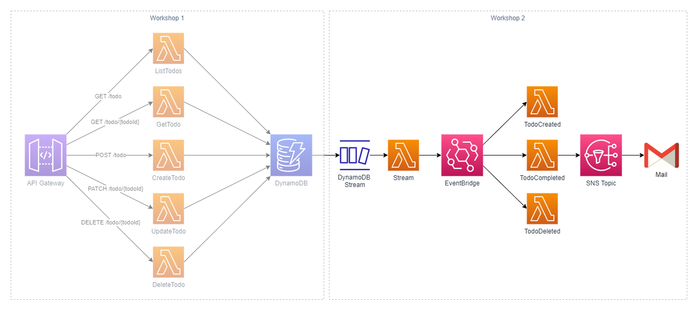
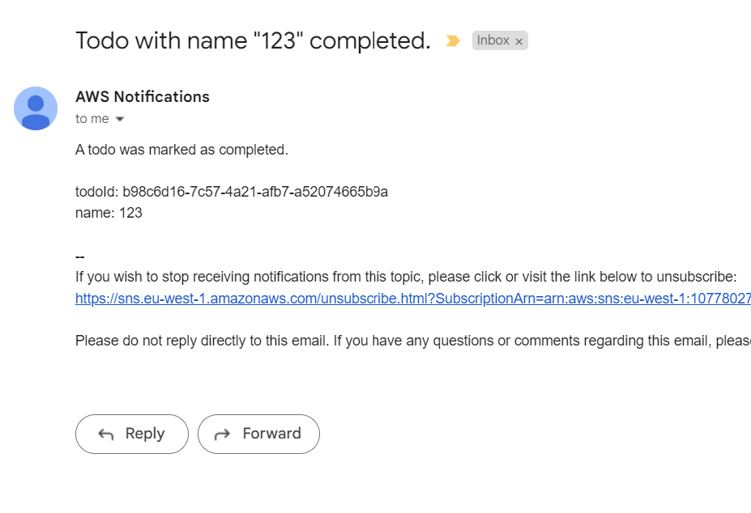

# Workshop 2: Events

## 1. Introduction

Many cloud (and especially serverless) applications today use Event-Driven Architecture. In EDA, services communicate asynchronously by producing and consuming **events**. Some benefits of event-driven architecture include:

- **Loose coupling:** Services can communicate via an event broker. Producers do not need to know the inner workings of consumers and vice versa.

- **Fault tolerance:** Asynchronous messaging allows for retry logic in every service. If a consumer fails, it can retry the event instead of having the producer re-send it.

- **Independent teams:** Teams can build and ship features independent of each other. It is easy to hook up a new consumer to an existing event. This requires good documentation and schema practices.

In this workshop, you will build upon the application from the previous workshop. You will explore DynamoDB streams, EventBridge, and SNS Topics. These are some of the ways on AWS to send events between services in an asynchronous manner.

Whenever an item is created, deleted, or modified in the DynamoDB Table, an event will be sent out to a DynamoDB stream. These events include a snapshot of each DynamoDB item both before and after modification. You will add a Lambda function to this stream that sends three different events to an EventBridge Bus:

- **TodoCreated**: Event sent when a to-do item is created.
- **TodoCompleted**: Event sent when the `completed` attribute on an item is changed from `false` to `true`.
- **TodoDeleted**: Event sent when a to-do item is deleted.

You will then create three Lambda functions. Each function will handle a separate type of event by setting up target rules in EventBridge.

Finally, you will create an SNS topic and subscribe to it with your e-mail. Every time you mark a todo as completed, you will get a notification in your e-mail inbox.



### What are DynamoDB streams?

> "DynamoDB Streams captures a time-ordered sequence of item-level modifications in any DynamoDB table and stores this information in a log for up to 24 hours. Applications can access this log and view the data items as they appeared before and after they were modified, in near-real time." - [AWS Docs](https://docs.aws.amazon.com/amazondynamodb/latest/developerguide/Streams.html)

DynamoDB streams enable a wide range of use cases and patterns. It captures every item-level modification made to a table, ordered by time. You can then, for example, hook up a Lambda function to this stream to do further processing.

Some use cases include:

- **Replication:** Streams make it easy to replicate data between two tables by mirroring all events to another table. This is useful when doing a database migration between accounts. You can also use it to create a local copy of the database in another region for faster access in that region.
- **Indexing:** NoSQL databases are not particularly good for searching and filtering. Streams can help with this by indexing every item in an ElasticSearch cluster or similar.
- **Aggregations:** As with searching, NoSQL databases are not designed to perform ad-hoc aggregations. Using streams, you can aggregate data to another table.
- **Events:** Streams makes it easy to build a service than emit events every time you modify an item in a table.

In this workshop, you will use streams to publish events when a to-do item is created, marked as completed, or deleted.

### What is EventBridge?

> "Amazon EventBridge is a serverless event bus service that you can use to connect your applications with data from a variety of sources. EventBridge delivers a stream of real-time data from your applications, software as a service (SaaS) applications, and AWS services to targets such as AWS Lambda functions, HTTP invocation endpoints using API destinations, or event buses in other AWS accounts." - [AWS Docs](https://docs.aws.amazon.com/eventbridge/latest/userguide/eb-what-is.html)

EventBridge is the heart of many serverless event-driven applications. It provides a flexible and scalable way to publish and consume events. The event bus evaluates all incoming events against any rules you have created. These rules can then route events to a many different targets such as Lambda functions.

It also comes with advance functionality, such as event transformation and replay functionality.

In this workshop, you will use EventBridge as an event bus to route events to different Lambda functions.

### What is SNS?

> "Amazon Simple Notification Service (Amazon SNS) is a managed service that provides message delivery from publishers to subscribers (also known as producers and consumers). Publishers communicate asynchronously with subscribers by sending messages to a topic, which is a logical access point and communication channel. Clients can subscribe to the SNS topic and receive published messages using a supported endpoint type, such as Amazon Kinesis Data Firehose, Amazon SQS, AWS Lambda, HTTP, email, mobile push notifications, and mobile text messages (SMS)." - [AWS Docs](https://docs.aws.amazon.com/sns/latest/dg/welcome.html)

Like EventBridge, SNS can be used for asynchronous Pub-Sub communication. Before EventBridge was released, SNS was the go-to service to implement fan-out patterns (one event sent to many consumers). But, SNS still has a purpose with its generous throughput and subscription limits. You can have up to 12.5 MILLION subscribers on a single SNS topic.

[This blog post](https://medium.com/awesome-cloud/aws-difference-between-amazon-eventbridge-and-amazon-sns-comparison-aws-eventbridge-vs-aws-sns-46708bf5313) goes over some of the differences (and similarities) between SNS and EventBridge.

In this workshop, you will subscribe to an SNS topic with your e-mail to get notifications when you mark a to-do item as completed.

### Continuing from Workshop 1

This workshop builds upon the API built in [Workshop 1](../workshop1/README.md). If you haven't completed that one, I have provided a starting point in [workshops/workshop2/src](./src/) which you can use. In workshop 1, you built a simple Todo API with the following routes which you will use throughout this workshop:

- **GET /todo** - Lists all to-do items in the application, with support for pagination through `limit` and `next_token` query parameters.

- **GET /todo/{todoId}** - Fetches a single to-do item.

- **POST /todo** - Creates a new to-do item. Requires a `name` parameter in the payload.

- **UPDATE /todo/{todoId}** - Updates a to-do item. Accepts `name` and `completed` parameter in the payload.

- **DELETE /todo/{todoId}** - Deletes a to-do item.

## 2. Enable DynamoDB stream

Start with setting up a stream on your DynamoDB table. Creating a time-ordered stream that captures all changes made to the database sounds complicated right? Wrong, add the following line to your `table` configuration in `lib/todo-app-stack.ts`:

```typescript
// DynamoDB Table
table = new Table(this, "TodoTable", {
  partitionKey: {
    name: "todoId",
    type: AttributeType.STRING,
  },
  billingMode: BillingMode.PAY_PER_REQUEST,
  stream: StreamViewType.NEW_AND_OLD_IMAGES, // add this line
  pointInTimeRecovery: true,
});
```

**Make sure to update your imports to import `StreamViewType` from `aws-cdk-lib/aws-dynamodb`.**

Streams support four different `StreamViewTypes`. The view type determines what data the stream records will include:

- `KEYS_ONLY`: Only the key attributes of the modified item
- `NEW_IMAGE`: The entire item as it appears after it was modified
- `OLD_IMAGE`: The entire item as it appears before it was modified
- `NEW_AND_OLD_IMAGES`: Both the new and the old images of the modified item

In your case, pick `NEW_AND_OLD_IMAGES`.

## 3. Create stream function

### 3.1 Create a new handler file

Now, you will add a Lambda function that listens to the newly created DynamoDB stream. In the `functions/` directory, create a new sub-directory called `stream` and add a file named `handler.ts` with the following content:

```typescript
import { DynamoDBStreamEvent, DynamoDBRecord } from "aws-lambda";

export const handler = async function (
  event: DynamoDBStreamEvent
): Promise<void> {
  for await (const record of event.Records) {
    console.log(record);
    console.log(record.dynamodb?.NewImage);
    console.log(record.dynamodb?.OldImage);
  }
};
```

### 3.2 Refactor common function properties

Open up `lib/todo-app-stack.ts`. Remember in workshop 1 when you extracted common function parameters? This function could re-use those as well, but it will not use all that configuration (the `TABLE_NAME` environment variable for example). Add a new `apiFunctionProps` object alongside `commonFunctionProps` and update the existing functions to use both:

```typescript
const commonFunctionProps: NodejsFunctionProps = {
  handler: "handler",
  runtime: Runtime.NODEJS_16_X,
  memorySize: 1024,
  timeout: cdk.Duration.seconds(60),
  bundling: {
    minify: true,
  },
};

const apiFunctionProps: NodejsFunctionProps = {
  timeout: cdk.Duration.seconds(29),
  environment: {
    TABLE_NAME: table.tableName,
  },
};

const getFunction = new NodejsFunction(this, "GetTodoFunction", {
  entry: "functions/getTodo/handler.ts",
  ...commonFunctionProps,
  ...apiFunctionProps,
});

// update the rest of the functions as well
```

### 3.3 Add the function and integrate it with your stream

Now, add the new function to your CDK stack:

```typescript
const streamFunction = new NodejsFunction(this, "StreamFunction", {
  entry: "functions/stream/handler.ts",
  ...commonFunctionProps,
  // api props not needed here
});
```

Add the following imports:

```typescript
import { DynamoEventSource } from "aws-cdk-lib/aws-lambda-event-sources";
import { StartingPosition } from "aws-cdk-lib/aws-lambda";
```

Now you need to glue the parts together and add the stream as an event source to the Lambda function. Add the following:

```typescript
// DynamoDB stream integration
streamFunction.addEventSource(
  new DynamoEventSource(table, {
    startingPosition: StartingPosition.TRIM_HORIZON,
    batchSize: 10,
    retryAttempts: 3,
  })
);
```

### 3.4 Deploy and test your stream

Deploy your CDK application with `cdk deploy`. When finished, you can use the SAM CLI to tail logs in your terminal with `sam logs --stack-name TodoAppStack --tail`.

Now, call your API and create, update, and delete a to-do item. You should see logs from the function connected to the stream looking something like this:

```
2022-10-13T17:36:00.072Z        01a362b0-da79-4fde-8ff2-5cc80b03aceb        INFO    {
  eventID: '36299d93fa7ba90a1c0f7e9b4c35a98f',
  eventName: 'MODIFY',
  eventVersion: '1.1',
  eventSource: 'aws:dynamodb',
  awsRegion: 'eu-west-1',
  dynamodb: {
    ApproximateCreationDateTime: 1665682559,
    Keys: { todoId: [Object] },
    NewImage: {
      createdAt: [Object],
      name: [Object],
      completed: [Object],
      todoId: [Object],
      updatedAt: [Object]
    },
    OldImage: {
      createdAt: [Object],
      name: [Object],
      completed: [Object],
      todoId: [Object],
      updatedAt: [Object]
    },
    SequenceNumber: '137600000000021133042909',
    SizeBytes: 228,
    StreamViewType: 'NEW_AND_OLD_IMAGES'
  },
  eventSourceARN: 'arn:aws:dynamodb:eu-west-1:123456789012:table/TodoAppStack-TodoTable585F1D-RAM0KESO6/stream/2022-10-13T17:17:43.652'
}
2022-10-13T17:36:00.072Z        01a362b0-da79-4fde-8ff2-5cc80b03aceb        INFO    {
  createdAt: { N: '1665681587059' },
  name: { S: '123' },
  completed: { BOOL: false },
  todoId: { S: '499cc36c-ae1e-4065-86a4-60802d245b49' },
  updatedAt: { N: '1665682559139' }
}
2022-10-13T17:36:00.072Z        01a362b0-da79-4fde-8ff2-5cc80b03aceb        INFO    {
  createdAt: { N: '1665681587059' },
  name: { S: '123' },
  completed: { BOOL: false },
  todoId: { S: '499cc36c-ae1e-4065-86a4-60802d245b49' },
  updatedAt: { N: '1665682372356' }
}
```

This particular log event shows when I updated a to-do item, which you can see on the `eventName` being `MODIFY`. You can also see that both `NewImage` and `OldImage` is part of the incoming event. Looking at the contents of these, you can see that they are in the DynamoDB JSON format with `N`, `S`, `BOOL`, and so on.

### 3.5 Parse the records

Let's update the function to parse those records into something more manageable.

Add the following to `functions/stream/handler.ts`:

```typescript
import { unmarshall } from "@aws-sdk/util-dynamodb";
import { AttributeValue } from "@aws-sdk/client-dynamodb";

interface todoItem {
  todoId: string;
  name: string;
  completed: boolean;
  createdAt: number;
  updatedAt: number;
}

interface streamRecord {
  newItem: todoItem | undefined;
  oldItem: todoItem | undefined;
}

const parseRecord = (record: DynamoDBRecord): streamRecord => {
  let newItem;
  let oldItem;

  if (record.dynamodb?.NewImage) {
    newItem = unmarshall(
      record.dynamodb?.NewImage as { [key: string]: AttributeValue }
    ) as todoItem;
  }

  if (record.dynamodb?.OldImage) {
    oldItem = unmarshall(
      record.dynamodb?.OldImage as { [key: string]: AttributeValue }
    ) as todoItem;
  }

  return { newItem, oldItem };
};
```

This function will parse your records from the DynamoDB JSON format into objects with the `todoItem` interface.

There are a few TS gotchas here that are quite ugly, but I haven't found any cleaner solution as of now. The type casting `record.dynamodb?.NewImage as { [key: string]: AttributeValue }` is required because there is a type mismatch between `@aws-sdk/dynamodb` and `DynamoDBRecord` from `@types/aws-lambda`.

Now, replace the `handler` function with the following code:

```typescript
export const handler = async function (
  event: DynamoDBStreamEvent
): Promise<void> {
  for await (const record of event.Records) {
    const todoRecord = parseRecord(record);

    switch (record.eventName) {
      case "INSERT": {
        console.log("Item Created: ", todoRecord.newItem);
        break;
      }
      case "MODIFY": {
        console.log("Item Modified: ", todoRecord.oldItem, todoRecord.newItem);
        break;
      }
      case "REMOVE": {
        console.log("Item Deleted: ", todoRecord.oldItem);
        break;
      }
    }
  }
};
```

### 3.6 Deploy and test your stream (again)

Deploy your application and tail the logs again. Now, when you update an item you should instead see the following log:

```
2022-10-13T17:55:38.757Z        0fea4cc0-0eb2-4aea-ae8e-6051da2afce7        INFO    Item Modified:  {
  createdAt: 1665681587059,
  name: 'oldName',
  completed: false,
  todoId: '499cc36c-ae1e-4065-86a4-60802d245b49',
  updatedAt: 1665682559139
} {
  createdAt: 1665681587059,
  name: 'newName',
  completed: false,
  todoId: '499cc36c-ae1e-4065-86a4-60802d245b49',
  updatedAt: 1665683737519
}
```

A lot cleaner than the DynamoDB JSON format, right?

## 4. Create EventBridge bus

Now you will add an EventBridge bus to your CDK application. Open up `lib/todo-app-stack.ts`.

First, add the following import:

```typescript
import { EventBus } from "aws-cdk-lib/aws-events";
```

Then, create the bus:

```typescript
// EventBridge bus
const bus = new EventBus(this, "TodoEventBus");
```

Continue with adding an environment variable to the `StreamFunction` containing the event bus name:

```typescript
const streamFunction = new NodejsFunction(this, "StreamFunction", {
  entry: "functions/stream/handler.ts",
  ...commonFunctionProps,
  // add the lines below
  environment: {
    EVENT_BUS_NAME: bus.eventBusName,
  },
});
```

Finally, the IAM role of the function requires permission to send messages to the bus:

```typescript
// Add Lambda runtime permissions
// ...
bus.grantPutEventsTo(streamFunction);
```

## 5. Publish events to EventBridge from stream function

Now, let's update the stream function to publish events to the event bus. You are going to implement three types of events:

- **TodoCreated**: Sent when a to-do item is created.
- **TodoCompleted**: Sent when a to-do item is set to completed.
- **TodoDeleted**: Sent when a to-do item is deleted.

You should use the AWS SDK EventBridge client, so add it as a dependency:

```
$ yarn add @aws-sdk/client-eventbridge
```

Add the folllowing `sendEvent` function to `functions/stream/handler.ts`:

```typescript
import {
  EventBridgeClient,
  PutEventsCommand,
} from "@aws-sdk/client-eventbridge";

/* ... */

const EVENT_BUS_NAME = process.env.EVENT_BUS_NAME || "";
const ebClient = new EventBridgeClient({});

/* ... */

const sendEvent = async (eventType: string, data: Record<string, any>) => {
  console.log(`Sending event: ${eventType}`);
  const res = await ebClient.send(
    new PutEventsCommand({
      Entries: [
        {
          Source: "TodoService",
          EventBusName: EVENT_BUS_NAME,
          Detail: JSON.stringify(data),
          DetailType: eventType,
        },
      ],
    })
  );
  console.log(`Event sent: ${eventType}`);
};
```

Now, update the `handler` function to send `TodoCreated`, `TodoCompleted`, and `TodoDeleted` events using the `sendEvent` function.

For simplicity, all events should have the same payload:

```json
{
  "todoId": "string";
  "name": "string";
  "completed": true;
  "createdAt": 123456789;
  "updatedAt": 123456789;
}
```

In the case of `TodoCreated` and `TodoCompleted`, the payload should reflect the item as it appears AFTER creation/modification. For `TodoDeleted`, the payload should reflect the item as it appeared BEFORE deletion.

If you only update the `name` of a to-do item, you will get a `MODIFY` event to your stream function. You only want to send a `TodoCompleted` event when a to-do item was marked as completed. How can you accomplish this?

<details>
<summary>Stream function handler spoiler</summary>

```typescript
export const handler = async function (
  event: DynamoDBStreamEvent
): Promise<void> {
  for await (const record of event.Records) {
    const todoRecord = parseRecord(record);

    switch (record.eventName) {
      case "INSERT": {
        console.log("Item Created: ", todoRecord.newItem);
        if (todoRecord.newItem) {
          await sendEvent("TodoCreated", todoRecord.newItem);
        }
        break;
      }
      case "MODIFY": {
        console.log("Item Modified: ", todoRecord.oldItem, todoRecord.newItem);
        if (
          todoRecord.newItem &&
          todoRecord.oldItem &&
          !todoRecord.oldItem.completed &&
          todoRecord.newItem.completed
        ) {
          await sendEvent("TodoCompleted", todoRecord.newItem);
        }
        break;
      }
      case "REMOVE": {
        console.log("Item Deleted: ", todoRecord.oldItem);
        if (todoRecord.oldItem) {
          await sendEvent("TodoDeleted", todoRecord.oldItem);
        }
        break;
      }
    }
  }
};
```

</details>

Deploy your CDK applications and tail the logs. Now, create a to-do item. Then, update it and mark it as completed. Finally, delete the to-do item. Looking at the logs for your stream function, you should see the following log entries:

```
2022-10-14T07:28:02.929Z        f7eadb48-02b8-476b-b5e9-aa9b9f235047     INFO    Event sent: todoCreated
2022-10-14T07:28:16.179Z        06e7a4d6-7cd8-42c4-bafa-f07371e1f366     INFO    Event sent: todoCompleted
2022-10-14T07:28:24.447Z        53a5720b-8e32-43ce-b09a-89217b1e2a25     INFO    Event sent: todoDeleted
```

## 6. Create functions to handle events from EventBridge

What good is publishing events if no-one is listening on the other side? Let's add three Lambda functions that will handle one type of event each.

### 6.1 Add function handlers

> **Note the different function signatures below.**

Add a function to handle `TodoCreated` events in `functions/todoCreatedEvent/handler.ts`:

```typescript
import { EventBridgeEvent } from "aws-lambda";

interface todoItem {
  todoId: string;
  name: string;
  completed: boolean;
  createdAt: number;
  updatedAt: number;
}

export const handler = async function (
  event: EventBridgeEvent<"TodoCreated", todoItem>
): Promise<void> {
  console.log(`Todo ${event.detail.todoId} created`, event);
};
```

Add a function to handle `TodoCompleted` events in `functions/todoCompletedEvent/handler.ts`:

```typescript
import { EventBridgeEvent } from "aws-lambda";

interface todoItem {
  todoId: string;
  name: string;
  completed: boolean;
  createdAt: number;
  updatedAt: number;
}

export const handler = async function (
  event: EventBridgeEvent<"TodoCompleted", todoItem>
): Promise<void> {
  console.log(`Todo ${event.detail.todoId} completed`, event);
};
```

Add a function to handle `TodoDeleted` events in `functions/todoDeletedEvent/handler.ts`:

```typescript
import { EventBridgeEvent } from "aws-lambda";

interface todoItem {
  todoId: string;
  name: string;
  completed: boolean;
  createdAt: number;
  updatedAt: number;
}

export const handler = async function (
  event: EventBridgeEvent<"TodoDeleted", todoItem>
): Promise<void> {
  console.log(`Todo ${event.detail.todoId} deleted`, event);
};
```

The observant reader might notice some code reuse here. The `todoItem` interface is now defined in a total of four places in the codebase. Feel free to remediate that in any way you see fit.

### 6.2 Add functions to CDK application

In `lib/todo-app-stack.ts`, add your new functions:

```typescript
const todoCreatedFunction = new NodejsFunction(this, "TodoCreatedFunction", {
  entry: "functions/todoCreatedEvent/handler.ts",
  ...commonFunctionProps,
});
const todoCompletedFunction = new NodejsFunction(
  this,
  "TodoCompletedFunction",
  {
    entry: "functions/todoCompletedEvent/handler.ts",
    ...commonFunctionProps,
  }
);
const todoDeletedFunction = new NodejsFunction(this, "TodoDeletedFunction", {
  entry: "functions/todoDeletedEvent/handler.ts",
  ...commonFunctionProps,
});
```

### 6.3 Add EventBridge rules

Now you will add rules to the EventBridge bus to send each type of event to the respective Lambda function.

First, import `Rule` and `LambdaFunction`:

```typescript
import { EventBus, Rule } from "aws-cdk-lib/aws-events";
import { LambdaFunction } from "aws-cdk-lib/aws-events-targets";
```

Then, add the following rules in the stack:

```typescript
// EventBridge integrations
new Rule(this, "TodoCreatedRule", {
  eventBus: bus,
  eventPattern: { detailType: ["TodoCreated"] },
  targets: [new LambdaFunction(todoCreatedFunction)],
});

new Rule(this, "TodoCompletedRule", {
  eventBus: bus,
  eventPattern: { detailType: ["TodoCompleted"] },
  targets: [new LambdaFunction(todoCompletedFunction)],
});

new Rule(this, "TodoDeletedRule", {
  eventBus: bus,
  eventPattern: { detailType: ["TodoDeleted"] },
  targets: [new LambdaFunction(todoDeletedFunction)],
});
```

Each rule has an event pattern that decides which target(s) that will receive each event. Events are mapped to the correct Lambda function depending on the `detailType` of the incoming event.

### 6.4 Deploy and test your events

Deploy the CDK application and tail the logs. As before, create, update, and delete a to-do item. You should find the following logs (each from a separate Lambda function):

```
2022-10-14T09:25:39.566Z        74e75014-ffbc-418b-8592-d67b57af4fdf    INFO    Todo 6da8a742-1974-47b2-b53a-a82836ab9047 created {
  version: '0',
  id: '9d23c5dc-4fda-3f62-0f3b-f08258974daa',
  'detail-type': 'TodoCreated',
  source: 'TodoService',
  account: '123456789012',
  time: '2022-10-14T09:25:38Z',
  region: 'eu-west-1',
  resources: [],
  detail: {
    createdAt: 1665739537823,
    name: '123',
    completed: false,
    todoId: '6da8a742-1974-47b2-b53a-a82836ab9047',
    updatedAt: 1665739537823
  }
}

2022-10-14T09:26:15.794Z        685bec54-685c-4f6b-a1ba-4c4d1c9c07af    INFO    Todo 6da8a742-1974-47b2-b53a-a82836ab9047 completed {
  version: '0',
  id: 'f3205183-fada-9ac3-5d7b-d21c7503949e',
  'detail-type': 'TodoCompleted',
  source: 'TodoService',
  account: '123456789012',
  time: '2022-10-14T09:26:15Z',
  region: 'eu-west-1',
  resources: [],
  detail: {
    createdAt: 1665739537823,
    name: '123',
    completed: true,
    todoId: '6da8a742-1974-47b2-b53a-a82836ab9047',
    updatedAt: 1665739574825
  }
}

2022-10-14T09:26:41.713Z        affcaae9-e9d2-414f-b43d-6bd9dbc12c03    INFO    Todo 6da8a742-1974-47b2-b53a-a82836ab9047 deleted {
  version: '0',
  id: 'd257d826-12f1-21a9-5097-7fc41ff6b77a',
  'detail-type': 'TodoDeleted',
  source: 'TodoService',
  account: '123456789012',
  time: '2022-10-14T09:26:40Z',
  region: 'eu-west-1',
  resources: [],
  detail: {
    createdAt: 1665739537823,
    name: '123',
    completed: true,
    todoId: '6da8a742-1974-47b2-b53a-a82836ab9047',
    updatedAt: 1665739574825
  }
}
```

In the next step, you will add additional functionality to the function that handles `TodoCompleted` events.

## 7. Create SNS topic to receive e-mails

As the final step, you will set up a way to get notified via e-mail whenever a to-do item is marked as completed.

### 7.1 Create SNS topic and subscription

In `lib/todo-app-stack.ts`, add the following imports:

```typescript
import { Topic } from "aws-cdk-lib/aws-sns";
import { EmailSubscription } from "aws-cdk-lib/aws-sns-subscriptions";
```

Then, add an SNS topic to your application and subscribe your e-mail to it:

```typescript
// SNS Topic
const topic = new Topic(this, "TodoEventTopic");
topic.addSubscription(new EmailSubscription("your@email.com"));
```

### 7.2 Update Lambda configuration

In the configuration of the `TodoCompletedFunction`, add the topic ARN as an environment variable:

```typescript
const todoCompletedFunction = new NodejsFunction(
  this,
  "TodoCompletedFunction",
  {
    /* ... */
    environment: {
      TOPIC_ARN: topic.topicArn,
    },
  }
);
```

You also need to grant the function permission to publish to the topic:

```typescript
// Add Lambda runtime permissions
/* ... */
topic.grantPublish(todoCompletedFunction);
```

### 7.3 Update Lambda function to publish to SNS

You need to add the SNS client library as a dependency:

```
$ yarn add @aws-sdk/client-sns
```

Now, in `functions/todoCompletedEvent/handler.ts`, update the `handler` method to send a message to the SNS topic using `PublishCommand`. You can send messages like this:

```typescript
const snsClient = new SNSClient({});

/* ... */
await snsClient.send(
  new PublishCommand({
    TopicArn: "TOPIC_ARN",
    Subject: "SUBJECT",
    Message: "MESSAGE",
  })
);
```

Read the topic ARN from the environment variable you added in the previous step. Add a relevant `Subject` and `Message` to the published message.

<details>
<summary>TodoCompletedEvent function spoiler</summary>

```typescript
import { EventBridgeEvent } from "aws-lambda";
import { SNSClient, PublishCommand } from "@aws-sdk/client-sns";

interface todoItem {
  todoId: string;
  name: string;
  completed: boolean;
  createdAt: number;
  updatedAt: number;
}

const TOPIC_ARN = process.env.TOPIC_ARN || "";
const snsClient = new SNSClient({});

export const handler = async function (
  event: EventBridgeEvent<"TodoCompleted", todoItem>
): Promise<void> {
  console.log(`Todo ${event.detail.todoId} completed`, event);
  await snsClient.send(
    new PublishCommand({
      TopicArn: TOPIC_ARN,
      Subject: `Todo with name "${event.detail.name}" completed.`,
      Message: `A todo was marked as completed. \n\ntodoId: ${event.detail.todoId} \nname: ${event.detail.name}`,
    })
  );
};
```

</details>

### 7.4 Deploy and test your subscription

Deploy the application and head over to your mail inbox. Search for an email from **AWS Notifications** (it might end up in the spam folder). In the e-mail, click the _Confirm subscription_ link.

Now, create a new to-do item. Then, update it through the API and mark it as completed.

Head back to your inbox. If everything worked, you should see an e-mail like this in your inbox:



## 8. Summary

Well done! You have now implemented an event-driven application using some of the services offered by AWS. Decoupling services helps with developing, building, and testing services in isolation. For example, the only responsibility of the `UpdateTodo` function is to update a to-do item in the database. It does not need to handle, or know about, the publishing of events.

The infrastructure you have built is also easy to extend. Do more consumers need access to the events? Add more rules to the EventBridge bus and add the consumers as targets. Do you need an event when a to-do item gets its name changed? Update the stream function to handle that. These changes require zero changes to your API functions.
