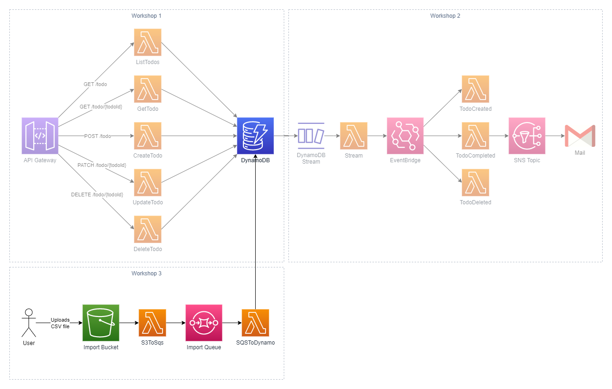

# Workshop 3: Scalable import process

## 1. Introduction

In this workshop you will add a scalable import process to your todo service. While doing this, you will learn how to use **AWS S3** and **S3 Event Notifications** together with **Lambda functions** and **SQS Queues**. You will see how the queue will act as a buffer for data to be imported. This creates a more scalable solution than simply writing to DynamoDB in the first Lambda function.

Imagine that the data store for your service was a relational database that cannot scale on demand. If you suddenly get a large influx of files to import, the Lambda service would happily scale out to as many concurrent invocations as needed. This could potentially overload the backing database, resulting in errors and data loss. There is also a limitation on Lambda that a function can run for a maximum of 15 minutes.

By using a queue as a buffer, you can control the speed at which items are read from the queue and thus control the load on downstream services. It also lets you add retry mechanisms and dead-letter queues to be able to gracefully handle errors.



### What is S3?

> "Amazon Simple Storage Service (Amazon S3) is an object storage service that offers industry-leading scalability, data availability, security, and performance. Customers of all sizes and industries can use Amazon S3 to store and protect any amount of data for a range of use cases, such as data lakes, websites, mobile applications, backup and restore, archive, enterprise applications, IoT devices, and big data analytics. Amazon S3 provides management features so that you can optimize, organize, and configure access to your data to meet your specific business, organizational, and compliance requirements." - [AWS Docs](https://docs.aws.amazon.com/AmazonS3/latest/userguide/Welcome.html)

In this workshop you will use S3 to upload CSV files containing todo items. Each row in these files will then be imported into the DynamoDB table.

### What is SQS?

> "Amazon Simple Queue Service (Amazon SQS) offers a secure, durable, and available hosted queue that lets you integrate and decouple distributed software systems and components. Amazon SQS offers common constructs such as dead-letter queues and cost allocation tags. It provides a generic web services API that you can access using any programming language that the AWS SDK supports." - [AWS Docs](https://docs.aws.amazon.com/AWSSimpleQueueService/latest/SQSDeveloperGuide/welcome.html)

One of the use cases for SQS is to implement 1:1 asynchronous messaging. In this workshop, you will use it as a buffer queue to make sure the import service is scalable. In the diagram above, you could write items to DynamoDB from the S3ToSqs function. But what if you uploaded a file with a million rows, or if the database is unavailable at the time of import? If the database is unavailable or throttled, or if your lambda function times out, you would lose data.

By using SQS as a buffer, the first Lambda function can read the file and add each row as a separate item on the queue. The second Lambda function can then read items in smaller batches from this queue and insert them into the table. If the database fails in this case, you can add retry mechanisms and dead-letter-queues to create a resilient process.

### Continuing from previous workshops

This workshop continues from where we left off in the [previous workshop](../workshop2/README.md). If you haven't completed that one, I have provided a starting point in [workshops/workshop3/src](./src/) which you can use.

## 2. Create an S3 bucket and SQS Queue

Start by creating the required infrastructure in `lib/todo-app-stack.ts`:

```typescript
...
import { Bucket } from 'aws-cdk-lib/aws-s3';
import { Queue } from 'aws-cdk-lib/aws-sqs';

...

export class TodoAppStack extends cdk.Stack {
  constructor(scope: Construct, id: string, props?: cdk.StackProps) {
    super(scope, id, props);

    ...

    // S3 Bucket
    const bucket = new Bucket(this, 'TodoImportBucket');

    // Import Queue
    const queue = new Queue(this, 'TodoImportQueue', {
      visibilityTimeout: cdk.Duration.seconds(120),
    });

    ...

    // Outputs
    new cdk.CfnOutput(this, 'TodoImportBucketOutput', {
      value: bucket.bucketName,
    });

```

## 3. Create Lambda function to handle S3 events

In the `functions/` directory, add a new sub-directory named `s3ToSqs` and add a file `handler.ts` with the following contents:

```typescript
import { S3Event } from "aws-lambda";

export const handler = async function (event: S3Event): Promise<void> {
  for await (const record of event.Records) {
    console.log(record);
  }
};
```

Add the function to your CDK application in `lib/todo-stack-app.ts`:

```typescript
const s3ToSqsFunction = new NodejsFunction(this, "S3ToSqsFunction", {
  entry: "functions/s3ToSqs/handler.ts",
  ...commonFunctionProps,
  timeout: cdk.Duration.seconds(900),
  environment: {
    QUEUE_URL: queue.queueUrl,
  },
});
```

## 4. Set up integration between S3 and S3ToSqs function

You will now set up the integration between S3 and the S3ToSqs function. There are a bunch of available [event types](https://docs.aws.amazon.com/AmazonS3/latest/userguide/notification-how-to-event-types-and-destinations.html#supported-notification-event-types) to listen to. In your service, you want your function to trigger when an item is uploaded to the bucket, i.e. `s3:ObjectCreated:*`. You can also specify a prefix for event notifications. This is useful when a bucket has multiple purposes. You are perhaps storing files to be imported under the `import/` prefix and archives under the the `archive/` prefix. In this case, you would not want to trigger an import when an archive is uploaded.

In `lib/todo-app-stack.ts`, add/update the following imports:

```typescript
import { Bucket, EventType } from "aws-cdk-lib/aws-s3"; // add EventType to this import
import { LambdaDestination } from "aws-cdk-lib/aws-s3-notifications";
```

Then, add the integration between S3 and Lambda:

```typescript
// S3 integration
bucket.addEventNotification(
  EventType.OBJECT_CREATED,
  new LambdaDestination(s3ToSqsFunction),
  { prefix: "import/" }
);
```

### Deploy and test the integration

1.  Deploy your application with `cdk deploy`. You should get the name of the S3 bucket in the console output like so:

    ```
    Outputs:
    TodoAppStack.RestApiEndpoint0551178A = ...
    TodoAppStack.TodoImportBucketOutput = todoappstack-todoimportbucket9bc2d041-12345678  <--
    ```

2.  Either tail the logs with the `sam cli` or find the logs of your newly deployed **S3ToSqs** function in the CloudWatch console. You can tail the logs with the following command:

    ```
    sam logs --stack-name TodoAppStack --tail
    ```

3.  Create a `todos.csv` file and add a few todo items:

    ```
    name
    todo1
    todo2
    todo3
    todo4
    todo5
    todo6
    todo7
    todo8
    todo9
    todo10
    ```

4.  Upload this file to S3 by using the `aws cli` in another terminal than the one you are tailing logs in:

    ```bash
    $ aws s3 cp todos.csv s3://todoappstack-todoimportbucket9bc2d041-12345678/import/todos.csv

    upload: ./todos.csv to s3://todoappstack-todoimportbucket9bc2d041-12345678/import/todos.csv
    ```

5.  You should see a log entry with the following structure:

    ```
    2022-11-11T10:23:27.986Z        9df470f3-8e0c-420a-9408-f7cae5f45baa  INFO    {
        eventVersion: '2.1',
        eventSource: 'aws:s3',
        awsRegion: 'eu-west-1',
        eventTime: '2022-11-11T10:23:26.595Z',
        eventName: 'ObjectCreated:Put',
        userIdentity: { principalId: '...' },
        requestParameters: { sourceIPAddress: '...' },
        responseElements: {
            'x-amz-request-id': '...',
            'x-amz-id-2': '...'
        },
        s3: {
            s3SchemaVersion: '1.0',
            configurationId: '...',
            bucket: {
                name: 'todoappstack-todoimportbucket9bc2d041-12345678',
                ownerIdentity: [Object],
                arn: 'arn:aws:s3:::todoappstack-todoimportbucket9bc2d041-12345678'
            },
            object: {
                key: 'import/todos.csv',
                size: 66,
                eTag: '...',
                sequencer: '...'
            }
        }
    }
    ```

6.  From this log you can see on the `eventName` that an object was created in the bucket. You can also see from which bucket this event originated from via `s3.bucket.name` and the key of the object in `s3.object.key`.

## 6. Grant permissions to the S3ToSqs function

Before adding more logic to the **S3ToSqs** function you need to grant permissions to both S3 and SQS. As you can see in the event above, only metadata about the object is included in the event. You will need to download the contents of the object separately inside the lambda function.

In `lib/todo-app-stack.ts`, add the following permissions:

```typescript
    // Add Lambda runtime permissions
    ...
    bucket.grantRead(s3ToSqsFunction);
    queue.grantSendMessages(s3ToSqsFunction);
```

## 7. Update S3ToSqs function logic to send items to SQS

Time to add some logic to the **S3ToSqs** function. First, you will need to install a few dependenices:

```bash
$ yarn add @fast-csv/parse @aws-sdk/client-s3 @aws-sdk/client-sqs
```

Now, open `functions/s3ToSqs/handler.ts` and add the following imports and top-level constants:

```typescript
import { GetObjectCommand, S3Client } from "@aws-sdk/client-s3";
import { S3Event } from "aws-lambda";
import { parseStream } from "@fast-csv/parse";
import { SendMessageCommand, SQSClient } from "@aws-sdk/client-sqs";
import { Readable } from "stream";

const QUEUE_URL = process.env.QUEUE_URL || "";
const sqsClient = new SQSClient({});
const s3Client = new S3Client({});

// This should match the structure of your CSV file
type CsvRow = {
  name: string;
};
```

Now let's implement the `handler` function. Since `event` can contain multiple records in `event.Records` you need to loop over them. For each record, you then want to:

1. Download the object from S3.
2. Pass the downloaded stream to a CSV reader.
3. Publish a message to SQS with the contents of each row in the CSV file.

Downloading an object with the `aws sdk` can be done like this:

```typescript
const response = await s3Client.send(
  new GetObjectCommand({
    Bucket: "YOUR_BUCKET_NAME",
    Key: "path/to/your/object.csv",
  })
);
```

You can then pass the response stream to the CSV reader added with the `@fast-csv/parse` dependency:

```typescript
const csvStream = parseStream<T, T>(response.Body as Readable, {
  headers: true,
  ignoreEmpty: true,
});
```

Here, you can specify the row `type` by replacing the `T` types with your own `CsvRow` type. You can also see that we need to cast `response.Body` to `Readable`. This is because the `GetObjectCommand` returns different types depending on if the execution context is in a browser or in Node for example.

The options `headers: true` tells the parser to strip away the first row in the CSV file, and `ignoreEmpty` does what it says. It ignores empty lines.

With the stream constructed, you can then loop over the rows with:

```typescript
for await (const row of csvStream) {
  // Do something with row here
}
```

You want to send each row to the SQS queue. You can send messages using the following snippet:

```typescript
await sqsClient.send(
  new SendMessageCommand({
    QueueUrl: "YOUR_QUEUE_URL",
    MessageBody: JSON.stringify(YOUR_DATA),
  })
);
```

With the above parts you should be able to combine them into a handler that fulfils the requirements stated earlier.

**Need help? Below is a spoiler on how the file could look when done:**

<details>
<summary>S3ToSqs function handler spoiler</summary>

```typescript
import { GetObjectCommand, S3Client } from "@aws-sdk/client-s3";
import { S3Event } from "aws-lambda";
import { parseStream } from "@fast-csv/parse";
import { SendMessageCommand, SQSClient } from "@aws-sdk/client-sqs";
import { Readable } from "stream";

const QUEUE_URL = process.env.QUEUE_URL || "";
const sqsClient = new SQSClient({});
const s3Client = new S3Client({});

// This should match the structure of your CSV file
type CsvRow = {
  name: string;
};

export const handler = async function (event: S3Event): Promise<void> {
  // Loop over all records in the event
  for (const record of event.Records) {
    // Fetch the object from S3
    const response = await s3Client.send(
      new GetObjectCommand({
        Bucket: record.s3.bucket.name,
        Key: record.s3.object.key,
      })
    );

    // Create a CsvParserStream from the response
    const csvStream = parseStream<CsvRow, CsvRow>(response.Body as Readable, {
      headers: true,
      ignoreEmpty: true,
    });

    // Loop over the CSV rows in the stream
    for (const row of csvStream) {
      console.log(`Adding todo "${row.name}" to queue.`);
      // Send each row in the CSV to SQS
      await sqsClient.send(
        new SendMessageCommand({
          QueueUrl: QUEUE_URL,
          MessageBody: JSON.stringify(row),
        })
      );
    }
  }
};
```

</details>

### Deploy and verify SQS messages

Deploy your application again and upload a file to S3 (you can override the existing file by uploading the same file over and over). You should see logs that look like this in the **S3ToSqs** function:

```
2022-11-11T12:34:03.679Z        f906bdac-e795-4817-873d-93856082bf95  INFO    Adding todo "todo1" to queue.
2022-11-11T12:34:03.686Z        f906bdac-e795-4817-873d-93856082bf95  INFO    Adding todo "todo2" to queue.
2022-11-11T12:34:03.693Z        f906bdac-e795-4817-873d-93856082bf95  INFO    Adding todo "todo3" to queue.
2022-11-11T12:34:03.701Z        f906bdac-e795-4817-873d-93856082bf95  INFO    Adding todo "todo4" to queue.
2022-11-11T12:34:03.708Z        f906bdac-e795-4817-873d-93856082bf95  INFO    Adding todo "todo5" to queue.
2022-11-11T12:34:03.718Z        f906bdac-e795-4817-873d-93856082bf95  INFO    Adding todo "todo6" to queue.
2022-11-11T12:34:03.725Z        f906bdac-e795-4817-873d-93856082bf95  INFO    Adding todo "todo7" to queue.
2022-11-11T12:34:03.733Z        f906bdac-e795-4817-873d-93856082bf95  INFO    Adding todo "todo8" to queue.
2022-11-11T12:34:03.741Z        f906bdac-e795-4817-873d-93856082bf95  INFO    Adding todo "todo9" to queue.
2022-11-11T12:34:03.748Z        f906bdac-e795-4817-873d-93856082bf95  INFO    Adding todo "todo10" to queue.
```

Navigate to the [SQS console](https://eu-west-1.console.aws.amazon.com/sqs/v2/home) (and make sure you are in the correct region). You should see your queue and that you have a non-zero number in the _Messages available_ column. Take a look at some of the messages:

1. Click the link with the name of the queue.
1. On the next page, click the _Send and receive messages_ button in the top right.
1. In the bottom _Receive messages_ section, click the _Poll for messages_ button.
1. You should see some messages appear in the table, click on one of them.
1. You should see a message _Body_ with a value similar to `{"name":"todo5"}`

## 9. Create Lambda function to handle SQS events

Now that you have messages waiting on the queue, let's create a Lambda function that can take care of them. Create a new sub-folder named `sqsToDynamo` in the `functions` directory and create a `handler.ts` file. Add the following:

```typescript
import { SQSEvent } from "aws-lambda";

export const handler = async function (event: SQSEvent): Promise<void> {
  for (const record of event.Records) {
    console.log(record);
  }
};
```

Add the function to the CDK application in `lib/todo-app-stack.ts`:

```typescript
const sqsToDynamo = new NodejsFunction(this, "SqsToDynamoFunction", {
  entry: "functions/sqsToDynamo/handler.ts",
  ...commonFunctionProps,
  timeout: cdk.Duration.seconds(60),
  environment: {
    TABLE_NAME: table.tableName,
  },
});
```

## 10. Set up integration between SQS and SqsToDynamo function

Now you need to hook up the Lambda function to the SQS queue. In `lib/todo-app-stack.ts`, update the import from `aws-cdk-lib/aws-lambda-event-sources` to include `SqsEventSource`. Then, add the integration construct:

```typescript
// SQS integration
sqsToDynamo.addEventSource(
  new SqsEventSource(queue, {
    batchSize: 5,
  })
);
```

The `batchSize` tells our Lambda function how many messages to pull for each invocation.

### Test the integration

You know this by now. Deploy the application and tail the logs or head over to cloudwatch. Upload a file to S3 again. If everything works as expected the following should now happen:

1. A file is uploaded.
1. An S3 notification is sent to the S3ToSqs function.
1. The function downloads the file and parses it.
1. For each CSV row in the file, it sends a message to SQS.
1. The messages in SQS is read by the **SqsToDynamo** function.

Right now, the **SqsToDynamo** function only logs the incoming messages. You should see log entries with the following structure:

```
2022-11-11T13:05:44.369Z        615d81a2-a669-5ce8-95c5-da4aec818340  INFO    {
  messageId: '...',
  receiptHandle: '...',
  body: '{"name":"todo9"}',
  attributes: {
    ApproximateReceiveCount: '3',
    AWSTraceHeader: '...',
    SentTimestamp: '1668170043744',
    SenderId: '...',
    ApproximateFirstReceiveTimestamp: '1668170272088'
  },
  messageAttributes: {},
  md5OfBody: '...',
  eventSource: 'aws:sqs',
  eventSourceARN: '...',
  awsRegion: 'eu-west-1'
}
```

## 11. Grant write permissions to the SqsToDynamo function

You need to grant permissions to the **SqsToDynamo** function so that it can write todo items to the DynamoDB table. In `lib/todo-app-stack.ts`, add the following line next to the rest of the runtime permissions:

```typescript
table.grantWriteData(sqsToDynamo);
```

## 12. Update SqsToDynamo function to write items to DynamoDB

Your function now consumes all messages that arrive on the queue. Let's persist those to the DynamoDB table. You should be able to take inspiration from the **CreateTodo** function on how to do this. They will be quite similar, but in this case you have a different event source (`SQSEvent` vs `APIGatewayProxyEvent`).

You will want to the following for **each** record in the incoming event:

1. Parse the message body (`record.body`).
1. Get the todo `name` from the parsed body.
1. Generate a unique ID, as done in **CreateTodo**.
1. Get the current timestamp which will be used for the `updatedAt` and `createdAt` fields.
1. Set `completed` to `false`.
1. Persist the item to the DynamoDB table.

**Getting stuck? There is a spoiler below:**

<details>
<summary>SqsToDynamo function handler spoiler</summary>

```typescript
import { SQSEvent } from "aws-lambda";
import { DynamoDBClient } from "@aws-sdk/client-dynamodb";
import { DynamoDBDocumentClient, PutCommand } from "@aws-sdk/lib-dynamodb";
import { v4 as uuidv4 } from "uuid";

const TABLE_NAME = process.env.TABLE_NAME || "";
const client = DynamoDBDocumentClient.from(new DynamoDBClient({}));

type Record = {
  name: string;
};

export const handler = async function (event: SQSEvent): Promise<void> {
  for (const record of event.Records) {
    const data = JSON.parse(record.body) as Record;
    console.log(`Importing todo item with name "${data.name}"`);

    const timestamp = new Date().getTime();

    const item = {
      todoId: uuidv4(),
      name: data.name,
      completed: false,
      createdAt: timestamp,
      updatedAt: timestamp,
    };

    await client.send(
      new PutCommand({
        TableName: TABLE_NAME,
        Item: item,
      })
    );

    console.log(`Todo ${item.todoId} created successfully`);
  }
};
```

</details>

## 13. Showtime

That's it. Deploy your application again and open up the DynamoDB console. Upload a CSV file with todo items again. You should almost instantly be able to see the imported items in your table. You can also query the **ListTodo** endpoint of your API to see them.

## Bonus content

If you managed to get this far with time to spare there are some improvements to look into:

### A. More CSV columns

Perhaps you would like to be able to import todo items with a known ID, creation time or completion status. Perhaps you want to add a completely new field. How would you go about supporting that?

### B. Limit throughput

Let's imagine that your table has limited provisioned capacity. It can only handle small concurrent loads. You only want one invocation of the **SqsToDynamo** function active at any point in time. How can you accomplish this?
